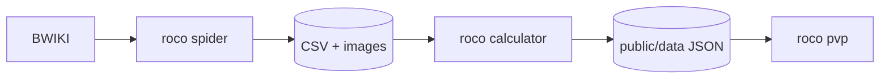

# Roco Kingdom · 洛克王国工具集

[](https://github.com/qwf18650819181/RocoKingdoms)

面向《洛克王国：世界》的爱好者工具 monorepo：**爬数据 → 本地图鉴配队 →（可选）PVP 自动化**。数据主要来自 [BWIKI 洛克王国世界](https://wiki.biligame.com/rocom/)。

```bash
git clone https://github.com/qwf18650819181/RocoKingdoms.git
cd RocoKingdoms
```

> 与腾讯 / 官方无关。游戏名称、精灵、立绘及数值版权归原权利方所有。请合理使用爬虫与自动化，风险自负。

---

## 子项目

| 目录 | 说明 | 技术栈 |
|------|------|--------|
| [**roco spider**](roco%20spider/README.md) | 从 BWIKI 抓取精灵/技能/克制表，导出 CSV 与图片 | Python · requests · pandas |
| [**roco calculator**](roco%20calculator/README.md) | 桌面精灵图鉴、克制图、PVP 配队与打击面分析 | Tauri 2 · React · TypeScript |
| [**roco pvp**](roco%20pvp/README.md) | 基于视觉识别 + 克制选招的 PVP 辅助（Windows） | Python · OpenCV · YOLO · Interception |

---

## 数据流



### 推荐更新流程

```bash
# 1. 爬取 Wiki
cd "roco spider"
pip install -r requirements.txt
python scraper.py

# 2. 导入图鉴
cd "../roco calculator"
npm install
npm run import-data
npm run tauri:dev          # 或 npm run tauri:build

# 3.（可选）同步到 PVP 并运行
cd "../roco pvp"
uv sync
uv run python scripts/sync_calculator_data.py
uv run roco-pvp run --dry-run
```

---

## 各项目能做什么

### roco spider

- MediaWiki Ask API 批量导出精灵、技能、蛋组、属性克制
- 下载立绘与属性/种族图标
- 详见 [roco spider/README.md](roco%20spider/README.md)

### roco calculator

- 离线浏览全部精灵，搜索 / 筛选 / 排序
- 技能列表、属性克制浮窗（双属性防御合并、共克 ×2 标识）
- PVP 六格配队、打击面统计、队伍 JSON 导入导出
- 深色主题、有图/无图模式
- 详见 [roco calculator/README.md](roco%20calculator/README.md)

### roco pvp

- 识别战斗界面与回合，按 calculator 数据与队伍 JSON 自动选技能键位
- 可选 YOLO 识别敌方精灵；支持 dry-run 调试
- 队伍文件与 calculator **保存队伍** 格式兼容
- 详见 [roco pvp/README.md](roco%20pvp/README.md)

---

## 环境总览

| 组件 | spider | calculator | pvp |
|------|--------|------------|-----|
| Python 3.9+ | ✅ | — | ✅ 3.10+ |
| Node.js 18+ | — | ✅ | — |
| Rust（Tauri） | — | ✅ 构建时 | — |
| Windows | 任意 | ✅ 主要平台 | ✅ 必须 |
| 管理员 + Interception | — | — | 正式出招需要 |

---

## 目录结构

```
roco kingdom/
├── README.md                 # 本文件
├── roco spider/
│   ├── scraper.py
│   ├── output/csv/           # 爬虫产物（可 gitignore）
│   └── output/images/
├── roco calculator/
│   ├── src/                  # React 前端
│   ├── src-tauri/            # Tauri 壳
│   ├── public/data/          # import-data 生成的 JSON
│   └── scripts/import_data.py
└── roco pvp/
    ├── roco_pvp/             # 核心库
    ├── config/
    ├── teams/
    ├── data/                 # 可选：从 calculator 同步
    └── yolo/
```

---

## 配队数据互通

calculator 与 pvp 使用同一类队伍 JSON 结构：

```json
[
  { "spiritId": 1, "skills": ["技能A", "技能B", null, null] },
  ...
]
```

- **calculator**：界面配队 →「保存队伍」
- **pvp**：`teams/main_team.json` 或 `config` 中的 `team_file`
- **pvp 脚本**：`scripts/build_recommended_team.py` 可按克制自动推荐 6 人队

---

## 参与贡献

1. 在对应子目录修改，保持 README 与脚本说明同步
2. 涉及数据字段变更时，顺序更新：**spider 导出 → calculator import → pvp sync**
3. calculator：`npm run build`；pvp：`uv run pytest`

---

## 免责声明

本仓库为爱好者开源/学习用途。爬虫请控制频率；PVP 自动化可能违反游戏协议。禁止商业使用与游戏资产再分发。一切法律责任由使用者自行承担。

---

## License

各子项目源码按仓库约定使用；游戏相关数据与美术资源不随本仓库授权。第三方依赖见其各自 LICENSE。
